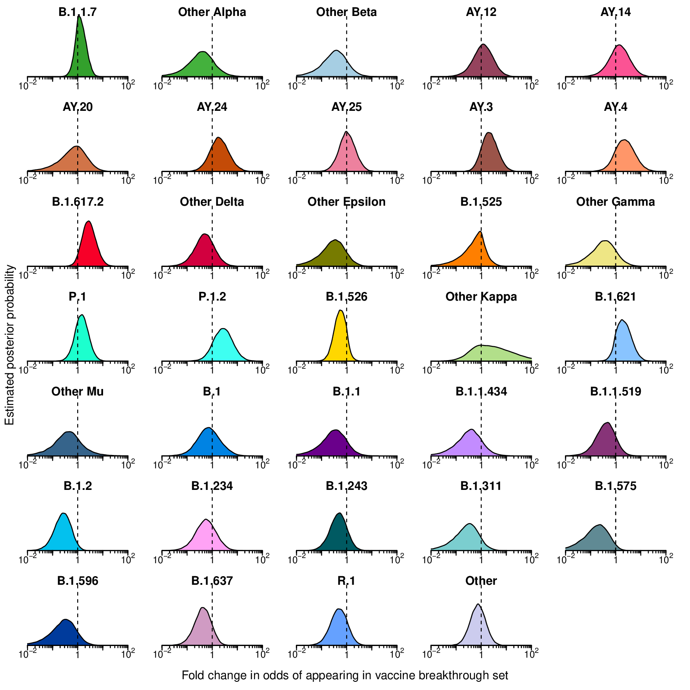

# Analysis code for "SARS-CoV-2 variants associated with vaccine breakthrough in the Delaware Valley through summer 2021" 

To regenerate the analysis, run `source('analyzeLineages.R')` in R.

The code depends on the R package `rstan` available from CRAN (`install.packages('rstan')`) and was run in R version 4.1.1 with `rstan` version 2.21.2. Note that the Stan model will probably take a few hours to run and is set to run 50 chains by default (you may want to adjust the nChains variable when running on computers with fewer cores).

This code should generate analysis result files in the `out` directory. Example output is available in the `exampleOut` directory with files:
 * countsPredictions.pdf:  Longitudinal stacked bar graphs depicting the SARS-CoV-2 variants present in surveillance, S gene target failure and vaccine breakthrough samples from the Delaware Valley, shown as the proportion of genomes classified as each variant lineage within each week. The numbers of genomes sampled each week are shown above the graph. Variants are colored according to the key at the bottom of the figure. The final plot shows the proportions of variants estimated from the surveillance count data using Bayesian autoregressive moving average multinomial logistic regression.
 
 * individualVariants.pdf: Frequencies of individual variants estimated using Bayesian autoregressive moving average multinomial logistic regression. Time is shown along the x-axis and estimated proportions of the surveillance population along the y-axis. The grey bars indicate raw proportions from the count data shaded by the number of observations observed in a given week (darker indicating more samples) while the colored lines indicate the proportion estimated by the Bayesian model. The light colored envelopes around each line show the 95% credible intervals for the proportion. 
 
 * sDropEnrichment.pdf: Estimated posterior probability densities for the enrichment of variants among spike gene target failures produced by Bayesian autoregressive moving average multinomial logistic regression. The x-axis shows the fold enrichment/depletion in the odds of a variant (labeled above each plot) appearing in the spike gene target failure set relative to the proportions estimated in the surveillance population and the y-axis shows the posterior probability. No enrichment (fold-change of 1) is indicated by the dashed vertical line. Increased density to the right indicates greater likelihood of inclusion among spike gene target failures, increased density to the left indicates decreased likelihood. Color coding indicates the variant queried with colors as in earlier figures.
 
 * vaccineEnrichment.pdf: Estimated posterior probability densities for the enrichment of variants among vaccine breakthrough samples produced by Bayesian autoregressive moving average multinomial logistic regression. The x-axis shows the fold enrichment/depletion in the odds of a variant (labeled above each plot) appearing in the vaccine breakthrough set relative to the proportions estimated in the surveillance population and the y-axis shows the posterior probability. No enrichment (fold-change of 1) is indicated by the dashed vertical line. Increased density to the right indicates greater likelihood of inclusion among vaccine breakthrough samples, increased density to the left indicates decreased likelihood. Color coding indicates the variant queried with colors as in earlier figures.
 
 * vaccineEnrichment.csv: Estimated fold enrichment in odds of appearing in vaccine breakthrough samples for each SARS-CoV-2 lineage.
 * sDropEnrichment.csv: Estimated fold enrichment in odds of appearing in the spike gene target failure set for each SARS-CoV-2 lineage.
 * lineageProps.csv: Posterior mean estimates of the longitudinal proportions of SARS-CoV-2 lineages in the surveillance population.

